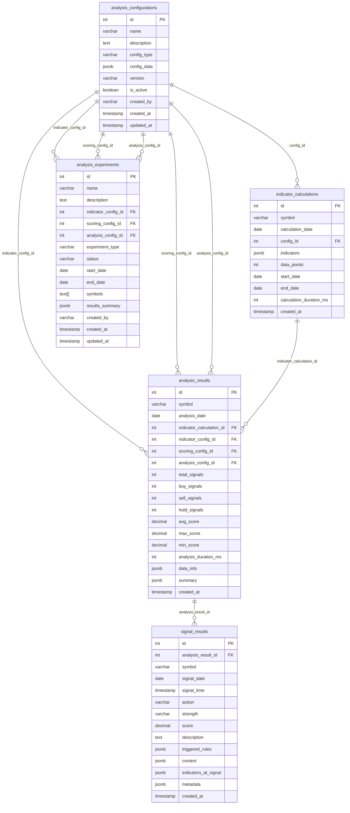

# Database Schema Documentation

## Tổng quan

Hệ thống phân tích StockAI sử dụng kiến trúc database mô-đun với 5 bảng chính, được thiết kế để tách biệt rõ ràng giữa cấu hình, tính toán chỉ số, kết quả phân tích và tín hiệu giao dịch.

## Sơ đồ ERD



## Chi tiết các bảng

### 1. analysis_configurations

**Mục đích**: Lưu trữ các cấu hình phân tích có thể tái sử dụng

**Cấu trúc**:
```sql
CREATE TABLE stockai.analysis_configurations (
    id SERIAL PRIMARY KEY,
    name VARCHAR(255) NOT NULL,
    description TEXT,
    config_type VARCHAR(50) NOT NULL, -- 'indicator', 'scoring', 'analysis'
    config_data JSONB NOT NULL,
    version VARCHAR(20) DEFAULT '1.0.0',
    is_active BOOLEAN DEFAULT true,
    created_by VARCHAR(100),
    created_at TIMESTAMP WITH TIME ZONE DEFAULT NOW(),
    updated_at TIMESTAMP WITH TIME ZONE DEFAULT NOW(),
    UNIQUE(name, version)
);
```

**Các loại cấu hình**:

#### Indicator Configuration
```json
{
    "ma_short": 9,
    "ma_long": 50,
    "ma_medium": 20,
    "rsi_period": 14,
    "rsi_overbought": 70,
    "rsi_oversold": 30,
    "macd_fast": 12,
    "macd_slow": 26,
    "macd_signal": 9,
    "bb_period": 20,
    "bb_std": 2.0,
    "volume_avg_period": 20,
    "volume_spike_multiplier": 1.8,
    "ichimoku_tenkan": 9,
    "ichimoku_kijun": 26,
    "ichimoku_senkou_b": 52,
    "obv_divergence_lookback": 30,
    "squeeze_lookback": 120
}
```

#### Scoring Configuration
```json
{
    "strong_threshold": 75.0,
    "medium_threshold": 25.0,
    "weak_threshold": 10.0,
    "buy_strong_threshold": -75.0,
    "buy_medium_threshold": -25.0,
    "sell_medium_threshold": 25.0,
    "sell_strong_threshold": 75.0,
    "context_multipliers": {
        "uptrend_buy": 1.5,
        "uptrend_sell": 0.5,
        "downtrend_sell": 1.5,
        "downtrend_buy": 0.5,
        "sideways": 0.7
    },
    "rule_weights": {
        "STRONG": 3.0,
        "MEDIUM": 2.0,
        "WEAK": 1.0
    }
}
```

#### Analysis Configuration
```json
{
    "min_score_threshold": 10.0,
    "lookback_days": 365,
    "signal_generation_enabled": true,
    "context_analysis_enabled": true,
    "export_enabled": true
}
```

### 2. indicator_calculations

**Mục đích**: Lưu trữ kết quả tính toán các chỉ số kỹ thuật

**Cấu trúc**:
```sql
CREATE TABLE stockai.indicator_calculations (
    id SERIAL PRIMARY KEY,
    symbol VARCHAR(10) NOT NULL,
    calculation_date DATE NOT NULL,
    config_id INTEGER REFERENCES stockai.analysis_configurations(id),
    indicators JSONB NOT NULL,
    data_points INTEGER NOT NULL,
    start_date DATE NOT NULL,
    end_date DATE NOT NULL,
    calculation_duration_ms INTEGER,
    created_at TIMESTAMP WITH TIME ZONE DEFAULT NOW(),
    UNIQUE(symbol, calculation_date, config_id)
);
```

**Cấu trúc JSONB indicators**:
```json
{
    "price": {
        "open": 21500.0,
        "high": 22000.0,
        "low": 21000.0,
        "close": 21800.0,
        "volume": 1000000
    },
    "moving_averages": {
        "ma9": 21600.0,
        "ma20": 21500.0,
        "ma50": 21400.0
    },
    "momentum": {
        "rsi": 65.5,
        "macd": 150.0,
        "macd_signal": 140.0,
        "macd_hist": 10.0
    },
    "volatility": {
        "bb_upper": 23000.0,
        "bb_lower": 20000.0,
        "bb_width": 0.15
    },
    "volume": {
        "volume": 1000000,
        "volume_avg": 800000,
        "volume_spike": 1.25,
        "obv": 50000000,
        "obv_ma20": 48000000
    },
    "ichimoku": {
        "tenkan": 21600.0,
        "kijun": 21500.0,
        "senkou_a": 21400.0,
        "senkou_b": 21300.0
    }
}
```

### 3. analysis_results

**Mục đích**: Lưu trữ kết quả phân tích tổng hợp với tham chiếu đến cấu hình

**Cấu trúc**:
```sql
CREATE TABLE stockai.analysis_results (
    id SERIAL PRIMARY KEY,
    symbol VARCHAR(10) NOT NULL,
    analysis_date DATE NOT NULL,
    indicator_calculation_id INTEGER REFERENCES stockai.indicator_calculations(id),
    indicator_config_id INTEGER REFERENCES stockai.analysis_configurations(id),
    scoring_config_id INTEGER REFERENCES stockai.analysis_configurations(id),
    analysis_config_id INTEGER REFERENCES stockai.analysis_configurations(id),
    total_signals INTEGER DEFAULT 0,
    buy_signals INTEGER DEFAULT 0,
    sell_signals INTEGER DEFAULT 0,
    hold_signals INTEGER DEFAULT 0,
    avg_score DECIMAL(10,2),
    max_score DECIMAL(10,2),
    min_score DECIMAL(10,2),
    analysis_duration_ms INTEGER,
    data_info JSONB,
    summary JSONB,
    created_at TIMESTAMP WITH TIME ZONE DEFAULT NOW(),
    UNIQUE(symbol, analysis_date, indicator_config_id, scoring_config_id, analysis_config_id)
);
```

**Cấu trúc JSONB data_info**:
```json
{
    "total_rows": 365,
    "start_date": "2025-01-01T00:00:00+00:00",
    "end_date": "2025-12-31T00:00:00+00:00",
    "data_source": "database",
    "columns": ["Open", "High", "Low", "Close", "Volume"]
}
```

**Cấu trúc JSONB summary**:
```json
{
    "total_signals": 25,
    "buy_signals": 12,
    "sell_signals": 8,
    "hold_signals": 5,
    "strong_signals": 3,
    "medium_signals": 15,
    "weak_signals": 7,
    "avg_score": 15.5,
    "max_score": 85.0,
    "min_score": -75.0,
    "score_std": 25.3
}
```

### 4. signal_results

**Mục đích**: Lưu trữ từng tín hiệu giao dịch với đầy đủ ngữ cảnh

**Cấu trúc**:
```sql
CREATE TABLE stockai.signal_results (
    id SERIAL PRIMARY KEY,
    analysis_result_id INTEGER REFERENCES stockai.analysis_results(id),
    symbol VARCHAR(10) NOT NULL,
    signal_date DATE NOT NULL,
    signal_time TIMESTAMP WITH TIME ZONE NOT NULL,
    action VARCHAR(10) NOT NULL, -- 'MUA', 'BÁN', 'THEO DÕI'
    strength VARCHAR(20) NOT NULL, -- 'WEAK', 'MEDIUM', 'STRONG', 'RẤT MẠNH'
    score DECIMAL(10,2) NOT NULL,
    description TEXT,
    triggered_rules JSONB,
    context JSONB,
    indicators_at_signal JSONB,
    metadata JSONB,
    created_at TIMESTAMP WITH TIME ZONE DEFAULT NOW()
);
```

**Cấu trúc JSONB triggered_rules**:
```json
[
    {
        "name": "rsi_oversold",
        "description": "RSI quá bán (tín hiệu mua)",
        "weight": 15.0,
        "score": 15.0,
        "enabled": true
    },
    {
        "name": "ma_crossover_bullish",
        "description": "MA9 cắt lên MA50 (tín hiệu tăng)",
        "weight": 20.0,
        "score": 20.0,
        "enabled": true
    }
]
```

**Cấu trúc JSONB context**:
```json
{
    "trend": "uptrend",
    "volatility": "medium",
    "volume": "high",
    "rsi_zone": "oversold",
    "ichimoku": "bullish",
    "price_position": "above_key_mas"
}
```

**Cấu trúc JSONB indicators_at_signal**:
```json
{
    "price": {
        "open": 21500.0,
        "high": 22000.0,
        "low": 21000.0,
        "close": 21800.0,
        "volume": 1000000
    },
    "moving_averages": {
        "ma9": 21600.0,
        "ma20": 21500.0,
        "ma50": 21400.0
    },
    "momentum": {
        "rsi": 25.5,
        "macd": 150.0,
        "macd_signal": 140.0,
        "macd_hist": 10.0
    }
}
```

### 5. analysis_experiments

**Mục đích**: Theo dõi các thí nghiệm với nhiều cấu hình khác nhau

**Cấu trúc**:
```sql
CREATE TABLE stockai.analysis_experiments (
    id SERIAL PRIMARY KEY,
    name VARCHAR(255) NOT NULL,
    description TEXT,
    indicator_config_id INTEGER REFERENCES stockai.analysis_configurations(id),
    scoring_config_id INTEGER REFERENCES stockai.analysis_configurations(id),
    analysis_config_id INTEGER REFERENCES stockai.analysis_configurations(id),
    experiment_type VARCHAR(50) DEFAULT 'backtest',
    status VARCHAR(20) DEFAULT 'active',
    start_date DATE,
    end_date DATE,
    symbols TEXT[],
    results_summary JSONB,
    created_by VARCHAR(100),
    created_at TIMESTAMP WITH TIME ZONE DEFAULT NOW(),
    updated_at TIMESTAMP WITH TIME ZONE DEFAULT NOW()
);
```

**Cấu trúc JSONB results_summary**:
```json
{
    "total_symbols": 100,
    "successful_analyses": 95,
    "failed_analyses": 5,
    "total_signals": 2500,
    "signal_summary": {
        "total_signals": 2500,
        "buy_signals": 1200,
        "sell_signals": 800,
        "hold_signals": 500,
        "strong_signals": 300,
        "medium_signals": 1500,
        "weak_signals": 700,
        "avg_score": 12.5,
        "max_score": 95.0,
        "min_score": -85.0
    },
    "performance_metrics": {
        "avg_analysis_time_ms": 1500,
        "success_rate": 0.95,
        "signal_generation_rate": 0.25
    }
}
```

## Indexes và Performance

### Primary Indexes
```sql
-- analysis_configurations
CREATE INDEX idx_analysis_configurations_type_active 
ON stockai.analysis_configurations(config_type, is_active);

-- indicator_calculations
CREATE INDEX idx_indicator_calculations_symbol_date 
ON stockai.indicator_calculations(symbol, calculation_date);

CREATE INDEX idx_indicator_calculations_config 
ON stockai.indicator_calculations(config_id);

-- analysis_results
CREATE INDEX idx_analysis_results_symbol_date 
ON stockai.analysis_results(symbol, analysis_date);

CREATE INDEX idx_analysis_results_configs 
ON stockai.analysis_results(indicator_config_id, scoring_config_id, analysis_config_id);

-- signal_results
CREATE INDEX idx_signal_results_symbol_date 
ON stockai.signal_results(symbol, signal_date);

CREATE INDEX idx_signal_results_action_strength 
ON stockai.signal_results(action, strength);

CREATE INDEX idx_signal_results_analysis_result 
ON stockai.signal_results(analysis_result_id);
```

### JSONB Indexes
```sql
-- Index cho config_data trong analysis_configurations
CREATE INDEX idx_analysis_configurations_config_data_gin 
ON stockai.analysis_configurations USING GIN (config_data);

-- Index cho indicators trong indicator_calculations
CREATE INDEX idx_indicator_calculations_indicators_gin 
ON stockai.indicator_calculations USING GIN (indicators);

-- Index cho triggered_rules trong signal_results
CREATE INDEX idx_signal_results_triggered_rules_gin 
ON stockai.signal_results USING GIN (triggered_rules);

-- Index cho context trong signal_results
CREATE INDEX idx_signal_results_context_gin 
ON stockai.signal_results USING GIN (context);
```

## Quan hệ và Constraints

### Foreign Key Constraints
```sql
-- indicator_calculations
ALTER TABLE stockai.indicator_calculations 
ADD CONSTRAINT fk_indicator_calculations_config 
FOREIGN KEY (config_id) REFERENCES stockai.analysis_configurations(id);

-- analysis_results
ALTER TABLE stockai.analysis_results 
ADD CONSTRAINT fk_analysis_results_indicator_calculation 
FOREIGN KEY (indicator_calculation_id) REFERENCES stockai.indicator_calculations(id);

ALTER TABLE stockai.analysis_results 
ADD CONSTRAINT fk_analysis_results_indicator_config 
FOREIGN KEY (indicator_config_id) REFERENCES stockai.analysis_configurations(id);

ALTER TABLE stockai.analysis_results 
ADD CONSTRAINT fk_analysis_results_scoring_config 
FOREIGN KEY (scoring_config_id) REFERENCES stockai.analysis_configurations(id);

ALTER TABLE stockai.analysis_results 
ADD CONSTRAINT fk_analysis_results_analysis_config 
FOREIGN KEY (analysis_config_id) REFERENCES stockai.analysis_configurations(id);

-- signal_results
ALTER TABLE stockai.signal_results 
ADD CONSTRAINT fk_signal_results_analysis_result 
FOREIGN KEY (analysis_result_id) REFERENCES stockai.analysis_results(id);

-- analysis_experiments
ALTER TABLE stockai.analysis_experiments 
ADD CONSTRAINT fk_analysis_experiments_indicator_config 
FOREIGN KEY (indicator_config_id) REFERENCES stockai.analysis_configurations(id);

ALTER TABLE stockai.analysis_experiments 
ADD CONSTRAINT fk_analysis_experiments_scoring_config 
FOREIGN KEY (scoring_config_id) REFERENCES stockai.analysis_configurations(id);

ALTER TABLE stockai.analysis_experiments 
ADD CONSTRAINT fk_analysis_experiments_analysis_config 
FOREIGN KEY (analysis_config_id) REFERENCES stockai.analysis_configurations(id);
```

### Unique Constraints
```sql
-- analysis_configurations
ALTER TABLE stockai.analysis_configurations 
ADD CONSTRAINT uk_analysis_configurations_name_version 
UNIQUE (name, version);

-- indicator_calculations
ALTER TABLE stockai.indicator_calculations 
ADD CONSTRAINT uk_indicator_calculations_symbol_date_config 
UNIQUE (symbol, calculation_date, config_id);

-- analysis_results
ALTER TABLE stockai.analysis_results 
ADD CONSTRAINT uk_analysis_results_symbol_date_configs 
UNIQUE (symbol, analysis_date, indicator_config_id, scoring_config_id, analysis_config_id);
```

## Truy vấn mẫu

### 1. Lấy tín hiệu mua mạnh gần đây
```sql
SELECT 
    sr.symbol,
    sr.signal_date,
    sr.signal_time,
    sr.score,
    sr.description,
    sr.context->>'trend' as trend,
    sr.context->>'volatility' as volatility
FROM stockai.signal_results sr
WHERE sr.action = 'MUA' 
    AND sr.strength = 'RẤT MẠNH'
    AND sr.signal_date >= CURRENT_DATE - INTERVAL '30 days'
ORDER BY sr.signal_time DESC
LIMIT 20;
```

### 2. So sánh hiệu quả các cấu hình
```sql
SELECT 
    ac.name as config_name,
    ac.config_data->>'rsi_period' as rsi_period,
    COUNT(ar.id) as analysis_count,
    AVG(ar.total_signals) as avg_signals,
    AVG(ar.avg_score) as avg_score
FROM stockai.analysis_results ar
JOIN stockai.analysis_configurations ac ON ar.indicator_config_id = ac.id
WHERE ac.config_type = 'indicator'
    AND ar.analysis_date >= CURRENT_DATE - INTERVAL '30 days'
GROUP BY ac.id, ac.name, ac.config_data->>'rsi_period'
ORDER BY avg_score DESC;
```

### 3. Truy vết từ tín hiệu đến cấu hình
```sql
SELECT 
    sr.symbol,
    sr.signal_date,
    sr.action,
    sr.strength,
    sr.score,
    ic.name as indicator_config,
    sc.name as scoring_config,
    ac.name as analysis_config
FROM stockai.signal_results sr
JOIN stockai.analysis_results ar ON sr.analysis_result_id = ar.id
JOIN stockai.analysis_configurations ic ON ar.indicator_config_id = ic.id
JOIN stockai.analysis_configurations sc ON ar.scoring_config_id = sc.id
JOIN stockai.analysis_configurations ac ON ar.analysis_config_id = ac.id
WHERE sr.symbol = 'PDR'
    AND sr.signal_date >= CURRENT_DATE - INTERVAL '7 days'
ORDER BY sr.signal_time DESC;
```

### 4. Thống kê sử dụng cấu hình
```sql
SELECT 
    ac.name,
    ac.config_type,
    ac.version,
    COUNT(DISTINCT ic.id) as indicator_calculations,
    COUNT(DISTINCT ar.id) as analysis_results,
    COUNT(DISTINCT sr.id) as total_signals
FROM stockai.analysis_configurations ac
LEFT JOIN stockai.indicator_calculations ic ON ac.id = ic.config_id
LEFT JOIN stockai.analysis_results ar ON ac.id IN (ar.indicator_config_id, ar.scoring_config_id, ar.analysis_config_id)
LEFT JOIN stockai.signal_results sr ON ar.id = sr.analysis_result_id
WHERE ac.is_active = true
GROUP BY ac.id, ac.name, ac.config_type, ac.version
ORDER BY total_signals DESC;
```

## Bảo trì và Tối ưu

### 1. Dọn dẹp dữ liệu cũ
```sql
-- Xóa các tính toán chỉ số cũ hơn 90 ngày (giữ lại 1 bản ghi mới nhất mỗi symbol)
DELETE FROM stockai.indicator_calculations 
WHERE calculation_date < CURRENT_DATE - INTERVAL '90 days'
    AND id NOT IN (
        SELECT DISTINCT ON (symbol) id 
        FROM stockai.indicator_calculations 
        ORDER BY symbol, calculation_date DESC
    );

-- Xóa các kết quả phân tích cũ hơn 180 ngày
DELETE FROM stockai.analysis_results 
WHERE analysis_date < CURRENT_DATE - INTERVAL '180 days';

-- Xóa các tín hiệu cũ hơn 1 năm
DELETE FROM stockai.signal_results 
WHERE signal_date < CURRENT_DATE - INTERVAL '1 year';
```

### 2. Cập nhật thống kê
```sql
-- Cập nhật thống kê cho PostgreSQL
ANALYZE stockai.analysis_configurations;
ANALYZE stockai.indicator_calculations;
ANALYZE stockai.analysis_results;
ANALYZE stockai.signal_results;
ANALYZE stockai.analysis_experiments;
```

### 3. Monitoring hiệu suất
```sql
-- Kiểm tra kích thước bảng
SELECT 
    schemaname,
    tablename,
    pg_size_pretty(pg_total_relation_size(schemaname||'.'||tablename)) as size
FROM pg_tables 
WHERE schemaname = 'stockai'
ORDER BY pg_total_relation_size(schemaname||'.'||tablename) DESC;

-- Kiểm tra sử dụng index
SELECT 
    indexname,
    idx_tup_read,
    idx_tup_fetch
FROM pg_stat_user_indexes 
WHERE schemaname = 'stockai'
ORDER BY idx_tup_read DESC;
```

## Backup và Recovery

### 1. Backup schema
```bash
pg_dump -h localhost -U postgres -d stockai --schema-only --schema=stockai > stockai_schema.sql
```

### 2. Backup dữ liệu
```bash
pg_dump -h localhost -U postgres -d stockai --data-only --schema=stockai > stockai_data.sql
```

### 3. Backup toàn bộ
```bash
pg_dump -h localhost -U postgres -d stockai --schema=stockai > stockai_full.sql
```

### 4. Restore
```bash
psql -h localhost -U postgres -d stockai < stockai_full.sql
```
