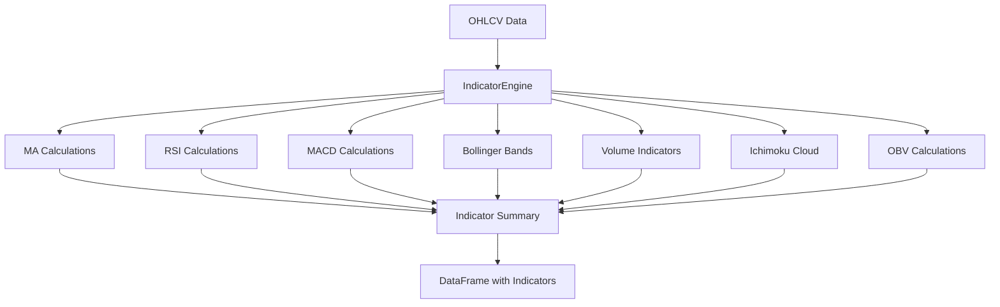

# Indicator Engine Documentation

## Tổng quan

Indicator Engine là mô-đun tính toán các chỉ số kỹ thuật thuần túy, không chứa logic chấm điểm hay tạo tín hiệu. Engine này tập trung vào việc tính toán chính xác các chỉ số kỹ thuật dựa trên dữ liệu OHLCV.

## Kiến trúc



## Cấu hình

### IndicatorConfig Class

```python
@dataclass
class IndicatorConfig:
    # Moving Averages
    ma_short: int = 9
    ma_long: int = 50
    ma_medium: int = 20
    
    # RSI
    rsi_period: int = 14
    rsi_overbought: float = 70
    rsi_oversold: float = 30
    
    # MACD
    macd_fast: int = 12
    macd_slow: int = 26
    macd_signal: int = 9
    
    # Bollinger Bands
    bb_period: int = 20
    bb_std: float = 2.0
    
    # Volume
    volume_avg_period: int = 20
    volume_spike_multiplier: float = 1.8
    
    # Ichimoku
    ichimoku_tenkan: int = 9
    ichimoku_kijun: int = 26
    ichimoku_senkou_b: int = 52
    
    # OBV
    obv_divergence_lookback: int = 30
    
    # Squeeze
    squeeze_lookback: int = 120
```

## Các chỉ số được tính toán

### 1. Moving Averages (MA)

#### Simple Moving Average (SMA)
```python
def _calculate_moving_averages(self, df: pd.DataFrame) -> pd.DataFrame:
    """Calculate various moving averages"""
    df['MA9'] = df['Close'].rolling(window=self.config.ma_short).mean()
    df['MA20'] = df['Close'].rolling(window=self.config.ma_medium).mean()
    df['MA50'] = df['Close'].rolling(window=self.config.ma_long).mean()
    return df
```

**Công thức**:
- MA9 = SMA(Close, 9)
- MA20 = SMA(Close, 20)
- MA50 = SMA(Close, 50)

**Ứng dụng**:
- Xác định xu hướng
- Hỗ trợ và kháng cự động
- Tín hiệu giao cắt

### 2. Relative Strength Index (RSI)

```python
def _calculate_rsi(self, df: pd.DataFrame) -> pd.DataFrame:
    """Calculate RSI (Relative Strength Index)"""
    delta = df['Close'].diff()
    gain = (delta.where(delta > 0, 0)).rolling(window=self.config.rsi_period).mean()
    loss = (-delta.where(delta < 0, 0)).rolling(window=self.config.rsi_period).mean()
    
    rs = gain / loss
    df['RSI'] = 100 - (100 / (1 + rs))
    return df
```

**Công thức**:
1. Tính thay đổi giá: `delta = Close - Close.shift(1)`
2. Tính gain và loss: `gain = max(delta, 0)`, `loss = max(-delta, 0)`
3. Tính trung bình: `avg_gain = SMA(gain, period)`, `avg_loss = SMA(loss, period)`
4. Tính RS: `RS = avg_gain / avg_loss`
5. Tính RSI: `RSI = 100 - (100 / (1 + RS))`

**Ứng dụng**:
- Xác định vùng quá mua/quá bán
- Tín hiệu phân kỳ
- Xác nhận xu hướng

### 3. MACD (Moving Average Convergence Divergence)

```python
def _calculate_macd(self, df: pd.DataFrame) -> pd.DataFrame:
    """Calculate MACD (Moving Average Convergence Divergence)"""
    ema_fast = df['Close'].ewm(span=self.config.macd_fast).mean()
    ema_slow = df['Close'].ewm(span=self.config.macd_slow).mean()
    
    df['MACD'] = ema_fast - ema_slow
    df['Signal_Line'] = df['MACD'].ewm(span=self.config.macd_signal).mean()
    df['MACD_Hist'] = df['MACD'] - df['Signal_Line']
    return df
```

**Công thức**:
1. EMA nhanh: `EMA_fast = EMA(Close, 12)`
2. EMA chậm: `EMA_slow = EMA(Close, 26)`
3. MACD Line: `MACD = EMA_fast - EMA_slow`
4. Signal Line: `Signal = EMA(MACD, 9)`
5. Histogram: `Histogram = MACD - Signal`

**Ứng dụng**:
- Tín hiệu giao cắt
- Xác nhận xu hướng
- Phân kỳ giá

### 4. Bollinger Bands

```python
def _calculate_bollinger_bands(self, df: pd.DataFrame) -> pd.DataFrame:
    """Calculate Bollinger Bands"""
    sma = df['Close'].rolling(window=self.config.bb_period).mean()
    std = df['Close'].rolling(window=self.config.bb_period).std()
    
    df['BB_Upper'] = sma + (std * self.config.bb_std)
    df['BB_Lower'] = sma - (std * self.config.bb_std)
    df['BB_Width'] = (df['BB_Upper'] - df['BB_Lower']) / sma
    df['BB_Std'] = std
    return df
```

**Công thức**:
1. Middle Band: `MB = SMA(Close, 20)`
2. Standard Deviation: `SD = STD(Close, 20)`
3. Upper Band: `UB = MB + (SD × 2)`
4. Lower Band: `LB = MB - (SD × 2)`
5. Band Width: `BW = (UB - LB) / MB`

**Ứng dụng**:
- Xác định biến động
- Tín hiệu breakout
- Hỗ trợ và kháng cự động

### 5. Volume Indicators

```python
def _calculate_volume_indicators(self, df: pd.DataFrame) -> pd.DataFrame:
    """Calculate volume-based indicators"""
    df['Vol_Avg_20'] = df['Volume'].rolling(window=self.config.volume_avg_period).mean()
    df['Volume_Spike'] = df['Volume'] / df['Vol_Avg_20']
    return df
```

**Công thức**:
1. Volume Average: `Vol_Avg = SMA(Volume, 20)`
2. Volume Spike: `Vol_Spike = Volume / Vol_Avg`

**Ứng dụng**:
- Xác nhận tín hiệu giá
- Phát hiện tích lũy/phân phối
- Tín hiệu breakout

### 6. Ichimoku Cloud

```python
def _calculate_ichimoku(self, df: pd.DataFrame) -> pd.DataFrame:
    """Calculate Ichimoku Cloud indicators"""
    # Tenkan-sen (Conversion Line)
    high_9 = df['High'].rolling(window=self.config.ichimoku_tenkan).max()
    low_9 = df['Low'].rolling(window=self.config.ichimoku_tenkan).min()
    df['Tenkan_sen'] = (high_9 + low_9) / 2
    
    # Kijun-sen (Base Line)
    high_26 = df['High'].rolling(window=self.config.ichimoku_kijun).max()
    low_26 = df['Low'].rolling(window=self.config.ichimoku_kijun).min()
    df['Kijun_sen'] = (high_26 + low_26) / 2
    
    # Senkou Span A (Leading Span A)
    df['Senkou_Span_A'] = ((df['Tenkan_sen'] + df['Kijun_sen']) / 2).shift(self.config.ichimoku_kijun)
    
    # Senkou Span B (Leading Span B)
    high_52 = df['High'].rolling(window=self.config.ichimoku_senkou_b).max()
    low_52 = df['Low'].rolling(window=self.config.ichimoku_senkou_b).min()
    df['Senkou_Span_B'] = ((high_52 + low_52) / 2).shift(self.config.ichimoku_kijun)
    
    return df
```

**Công thức**:
1. Tenkan-sen: `(Highest High + Lowest Low) / 2` (9 periods)
2. Kijun-sen: `(Highest High + Lowest Low) / 2` (26 periods)
3. Senkou Span A: `(Tenkan + Kijun) / 2` (shifted 26 periods)
4. Senkou Span B: `(Highest High + Lowest Low) / 2` (52 periods, shifted 26)

**Ứng dụng**:
- Xác định xu hướng
- Hỗ trợ và kháng cự
- Tín hiệu giao cắt

### 7. On-Balance Volume (OBV)

```python
def _calculate_obv(self, df: pd.DataFrame) -> pd.DataFrame:
    """Calculate OBV (On-Balance Volume)"""
    # Ensure Close column is numeric
    close_numeric = pd.to_numeric(df['Close'], errors='coerce')
    volume_numeric = pd.to_numeric(df['Volume'], errors='coerce')
    
    # Calculate price change
    price_change = close_numeric.diff()
    
    # Calculate OBV
    obv = np.where(price_change > 0, volume_numeric,
                  np.where(price_change < 0, -volume_numeric, 0))
    df['OBV'] = np.cumsum(obv)
    
    # OBV Moving Average
    df['OBV_MA20'] = df['OBV'].rolling(window=self.config.ma_medium).mean()
    
    return df
```

**Công thức**:
1. Price Change: `ΔPrice = Close - Close.shift(1)`
2. OBV Calculation:
   - If `ΔPrice > 0`: `OBV = OBV.shift(1) + Volume`
   - If `ΔPrice < 0`: `OBV = OBV.shift(1) - Volume`
   - If `ΔPrice = 0`: `OBV = OBV.shift(1)`
3. OBV MA: `OBV_MA = SMA(OBV, 20)`

**Ứng dụng**:
- Xác nhận xu hướng giá
- Phát hiện phân kỳ
- Tín hiệu tích lũy/phân phối

## Sử dụng

### 1. Khởi tạo Engine

```python
from analytis.engines.indicator_engine import IndicatorEngine, IndicatorConfig

# Sử dụng cấu hình mặc định
engine = IndicatorEngine()

# Hoặc tùy chỉnh cấu hình
config = IndicatorConfig(
    ma_short=5,
    ma_long=30,
    rsi_period=21,
    bb_period=15,
    bb_std=1.5
)
engine = IndicatorEngine(config)
```

### 2. Tính toán chỉ số

```python
import pandas as pd

# Dữ liệu OHLCV
df = pd.DataFrame({
    'Open': [100, 101, 102, 103, 104],
    'High': [105, 106, 107, 108, 109],
    'Low': [99, 100, 101, 102, 103],
    'Close': [101, 102, 103, 104, 105],
    'Volume': [1000, 1100, 1200, 1300, 1400]
})

# Tính toán tất cả chỉ số
df_with_indicators = engine.calculate_all_indicators(df)

# Xem kết quả
print(df_with_indicators[['Close', 'MA9', 'MA20', 'RSI', 'MACD']].tail())
```

### 3. Lấy tóm tắt chỉ số

```python
# Lấy tóm tắt chỉ số cho điểm dữ liệu cuối cùng
summary = engine.get_indicator_summary(df_with_indicators)

print("Price:", summary['price'])
print("Moving Averages:", summary['moving_averages'])
print("Momentum:", summary['momentum'])
print("Volatility:", summary['volatility'])
print("Volume:", summary['volume'])
print("Ichimoku:", summary['ichimoku'])
```

### 4. Kiểm tra tính hợp lệ dữ liệu

```python
# Kiểm tra dữ liệu có đủ để tính toán không
is_valid = engine.validate_data(df)

if is_valid:
    print("Dữ liệu hợp lệ, có thể tính toán chỉ số")
else:
    print("Dữ liệu không đủ, cần thêm dữ liệu lịch sử")
```

## Cấu trúc dữ liệu đầu ra

### DataFrame với chỉ số

```python
# Các cột được thêm vào DataFrame gốc
columns_added = [
    # Moving Averages
    'MA9', 'MA20', 'MA50',
    
    # RSI
    'RSI',
    
    # MACD
    'MACD', 'Signal_Line', 'MACD_Hist',
    
    # Bollinger Bands
    'BB_Upper', 'BB_Lower', 'BB_Width', 'BB_Std',
    
    # Volume
    'Vol_Avg_20', 'Volume_Spike',
    
    # Ichimoku
    'Tenkan_sen', 'Kijun_sen', 'Senkou_Span_A', 'Senkou_Span_B',
    
    # OBV
    'OBV', 'OBV_MA20'
]
```

### Indicator Summary

```python
{
    'price': {
        'open': 21500.0,
        'high': 22000.0,
        'low': 21000.0,
        'close': 21800.0,
        'volume': 1000000
    },
    'moving_averages': {
        'ma9': 21600.0,
        'ma20': 21500.0,
        'ma50': 21400.0
    },
    'momentum': {
        'rsi': 65.5,
        'macd': 150.0,
        'macd_signal': 140.0,
        'macd_hist': 10.0
    },
    'volatility': {
        'bb_upper': 23000.0,
        'bb_lower': 20000.0,
        'bb_width': 0.15
    },
    'volume': {
        'volume': 1000000,
        'volume_avg': 800000,
        'volume_spike': 1.25,
        'obv': 50000000,
        'obv_ma20': 48000000
    },
    'ichimoku': {
        'tenkan': 21600.0,
        'kijun': 21500.0,
        'senkou_a': 21400.0,
        'senkou_b': 21300.0
    }
}
```

## Xử lý lỗi

### 1. Dữ liệu không đủ

```python
# Kiểm tra trước khi tính toán
if not engine.validate_data(df):
    print("Cần ít nhất 52 điểm dữ liệu để tính toán đầy đủ")
    print(f"Hiện tại có: {len(df)} điểm dữ liệu")
```

### 2. Dữ liệu thiếu

```python
# Xử lý dữ liệu thiếu
df_clean = df.dropna(subset=['Open', 'High', 'Low', 'Close', 'Volume'])
df_with_indicators = engine.calculate_all_indicators(df_clean)
```

### 3. Dữ liệu không hợp lệ

```python
# Kiểm tra kiểu dữ liệu
df['Close'] = pd.to_numeric(df['Close'], errors='coerce')
df['Volume'] = pd.to_numeric(df['Volume'], errors='coerce')

# Loại bỏ giá trị không hợp lệ
df = df[(df['Close'] > 0) & (df['Volume'] >= 0)]
```

## Tối ưu hiệu suất

### 1. Sử dụng vectorization

```python
# Tốt: Sử dụng pandas vectorized operations
df['MA9'] = df['Close'].rolling(window=9).mean()

# Tránh: Sử dụng vòng lặp
# for i in range(9, len(df)):
#     df.loc[i, 'MA9'] = df['Close'].iloc[i-8:i+1].mean()
```

### 2. Caching kết quả

```python
# Lưu kết quả tính toán để tái sử dụng
import pickle

# Lưu
with open('indicators_cache.pkl', 'wb') as f:
    pickle.dump(df_with_indicators, f)

# Tải
with open('indicators_cache.pkl', 'rb') as f:
    df_with_indicators = pickle.load(f)
```

### 3. Batch processing

```python
# Xử lý nhiều mã cổ phiếu cùng lúc
symbols = ['PDR', 'VIC', 'VCB', 'VHM', 'HPG']
results = {}

for symbol in symbols:
    df = load_stock_data(symbol)
    results[symbol] = engine.calculate_all_indicators(df)
```

## Mở rộng

### 1. Thêm chỉ số mới

```python
class CustomIndicatorEngine(IndicatorEngine):
    def _calculate_custom_indicator(self, df: pd.DataFrame) -> pd.DataFrame:
        """Tính toán chỉ số tùy chỉnh"""
        # Logic tính toán
        df['Custom_Indicator'] = df['Close'].rolling(window=14).std()
        return df
    
    def calculate_all_indicators(self, df: pd.DataFrame) -> pd.DataFrame:
        """Ghi đè phương thức để thêm chỉ số mới"""
        # Gọi phương thức gốc
        df = super().calculate_all_indicators(df)
        
        # Thêm chỉ số tùy chỉnh
        df = self._calculate_custom_indicator(df)
        
        return df
```

### 2. Tùy chỉnh cấu hình

```python
# Tạo cấu hình cho thị trường cụ thể
vietnam_config = IndicatorConfig(
    ma_short=5,      # Thị trường biến động cao
    ma_long=30,      # Xu hướng ngắn hạn
    rsi_period=14,   # Chuẩn
    bb_std=1.5,      # Dải hẹp hơn
    volume_avg_period=10  # Volume trung bình ngắn hạn
)

# Tạo cấu hình cho phân tích dài hạn
long_term_config = IndicatorConfig(
    ma_short=20,
    ma_long=100,
    rsi_period=21,
    bb_period=30,
    bb_std=2.5,
    volume_avg_period=30
)
```

## Best Practices

### 1. Kiểm tra dữ liệu

```python
def validate_ohlcv_data(df: pd.DataFrame) -> bool:
    """Kiểm tra tính hợp lệ của dữ liệu OHLCV"""
    required_columns = ['Open', 'High', 'Low', 'Close', 'Volume']
    
    # Kiểm tra cột bắt buộc
    if not all(col in df.columns for col in required_columns):
        return False
    
    # Kiểm tra dữ liệu không rỗng
    if df.empty:
        return False
    
    # Kiểm tra giá trị hợp lệ
    if (df[required_columns] <= 0).any().any():
        return False
    
    # Kiểm tra logic OHLC
    if not (df['High'] >= df['Low']).all():
        return False
    
    if not (df['High'] >= df['Open']).all():
        return False
    
    if not (df['High'] >= df['Close']).all():
        return False
    
    if not (df['Low'] <= df['Open']).all():
        return False
    
    if not (df['Low'] <= df['Close']).all():
        return False
    
    return True
```

### 2. Xử lý dữ liệu thiếu

```python
def clean_ohlcv_data(df: pd.DataFrame) -> pd.DataFrame:
    """Làm sạch dữ liệu OHLCV"""
    # Loại bỏ hàng có dữ liệu thiếu
    df_clean = df.dropna(subset=['Open', 'High', 'Low', 'Close', 'Volume'])
    
    # Loại bỏ giá trị không hợp lệ
    df_clean = df_clean[
        (df_clean['Open'] > 0) &
        (df_clean['High'] > 0) &
        (df_clean['Low'] > 0) &
        (df_clean['Close'] > 0) &
        (df_clean['Volume'] >= 0)
    ]
    
    # Sắp xếp theo thời gian
    df_clean = df_clean.sort_index()
    
    return df_clean
```

### 3. Logging và monitoring

```python
import logging

logger = logging.getLogger(__name__)

def calculate_indicators_with_logging(engine, df):
    """Tính toán chỉ số với logging"""
    start_time = time.time()
    
    try:
        result = engine.calculate_all_indicators(df)
        
        duration = time.time() - start_time
        logger.info(f"Tính toán chỉ số thành công: {len(result)} điểm dữ liệu, {duration:.2f}s")
        
        return result
        
    except Exception as e:
        logger.error(f"Lỗi tính toán chỉ số: {e}")
        raise
```

## Troubleshooting

### 1. Lỗi "Insufficient data points"

**Nguyên nhân**: Không đủ dữ liệu để tính toán các chỉ số dài hạn

**Giải pháp**:
```python
# Kiểm tra số điểm dữ liệu
min_required = max(config.ichimoku_senkou_b, config.ma_long, config.bb_period)
if len(df) < min_required:
    print(f"Cần ít nhất {min_required} điểm dữ liệu")
    print(f"Hiện tại có: {len(df)} điểm")
```

### 2. Lỗi "TypeError: unorderable types"

**Nguyên nhân**: Dữ liệu không phải số

**Giải pháp**:
```python
# Chuyển đổi kiểu dữ liệu
df['Close'] = pd.to_numeric(df['Close'], errors='coerce')
df['Volume'] = pd.to_numeric(df['Volume'], errors='coerce')
```

### 3. Lỗi "KeyError: 'Close'"

**Nguyên nhân**: Thiếu cột bắt buộc

**Giải pháp**:
```python
# Kiểm tra cột bắt buộc
required_columns = ['Open', 'High', 'Low', 'Close', 'Volume']
missing_columns = [col for col in required_columns if col not in df.columns]
if missing_columns:
    print(f"Thiếu cột: {missing_columns}")
```
