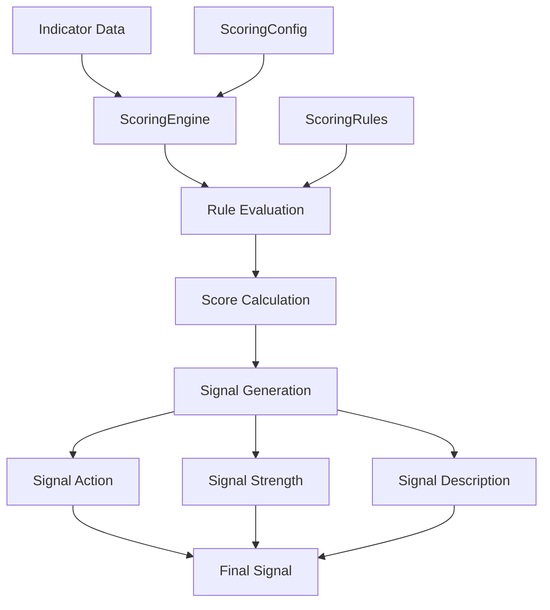

# Scoring Engine Documentation

## Tổng quan

Scoring Engine là mô-đun chấm điểm và đánh giá tín hiệu dựa trên các chỉ số kỹ thuật. Engine này sử dụng hệ thống quy tắc có thể cấu hình để tính điểm và tạo tín hiệu giao dịch.

## Kiến trúc



## Cấu hình

### ScoringConfig Class

```python
@dataclass
class ScoringConfig:
    # Signal strength thresholds
    strong_threshold: float = 75.0
    medium_threshold: float = 25.0
    weak_threshold: float = 10.0
    
    # Buy/Sell thresholds
    buy_strong_threshold: float = -75.0
    buy_medium_threshold: float = -25.0
    sell_medium_threshold: float = 25.0
    sell_strong_threshold: float = 75.0
    
    # Context multipliers
    context_multipliers: Dict[str, float] = None
    
    # Individual rule weights
    rule_weights: Dict[str, float] = None
```

### ScoringRule Class

```python
@dataclass
class ScoringRule:
    name: str
    weight: float
    condition: str  # Python expression to evaluate
    description: str
    enabled: bool = True
```

## Hệ thống quy tắc

### 1. Moving Average Rules

#### MA Crossover Bullish
```python
ScoringRule(
    name="ma_crossover_bullish",
    weight=20.0,
    condition="ma9 > ma50 and ma9.shift(1) <= ma50.shift(1)",
    description="MA9 cắt lên MA50 (tín hiệu tăng)",
    enabled=True
)
```

**Logic**: Khi MA9 cắt lên MA50, tín hiệu tăng giá
**Điểm**: +20 điểm
**Ứng dụng**: Xác nhận xu hướng tăng

#### MA Crossover Bearish
```python
ScoringRule(
    name="ma_crossover_bearish",
    weight=-20.0,
    condition="ma9 < ma50 and ma9.shift(1) >= ma50.shift(1)",
    description="MA9 cắt xuống MA50 (tín hiệu giảm)",
    enabled=True
)
```

**Logic**: Khi MA9 cắt xuống MA50, tín hiệu giảm giá
**Điểm**: -20 điểm
**Ứng dụng**: Xác nhận xu hướng giảm

#### Price Above MA
```python
ScoringRule(
    name="price_above_ma",
    weight=10.0,
    condition="close > ma9 and close > ma50",
    description="Giá trên cả MA9 và MA50",
    enabled=True
)
```

**Logic**: Giá đóng cửa trên cả MA9 và MA50
**Điểm**: +10 điểm
**Ứng dụng**: Xác nhận xu hướng tăng

#### Price Below MA
```python
ScoringRule(
    name="price_below_ma",
    weight=-10.0,
    condition="close < ma9 and close < ma50",
    description="Giá dưới cả MA9 và MA50",
    enabled=True
)
```

**Logic**: Giá đóng cửa dưới cả MA9 và MA50
**Điểm**: -10 điểm
**Ứng dụng**: Xác nhận xu hướng giảm

### 2. RSI Rules

#### RSI Oversold
```python
ScoringRule(
    name="rsi_oversold",
    weight=15.0,
    condition="rsi < 30 and rsi.shift(1) >= 30",
    description="RSI quá bán (tín hiệu mua)",
    enabled=True
)
```

**Logic**: RSI vượt qua ngưỡng 30 từ trên xuống
**Điểm**: +15 điểm
**Ứng dụng**: Tín hiệu mua khi quá bán

#### RSI Overbought
```python
ScoringRule(
    name="rsi_overbought",
    weight=-15.0,
    condition="rsi > 70 and rsi.shift(1) <= 70",
    description="RSI quá mua (tín hiệu bán)",
    enabled=True
)
```

**Logic**: RSI vượt qua ngưỡng 70 từ dưới lên
**Điểm**: -15 điểm
**Ứng dụng**: Tín hiệu bán khi quá mua

#### RSI Bullish Divergence
```python
ScoringRule(
    name="rsi_bullish_divergence",
    weight=25.0,
    condition="rsi > rsi.shift(1) and close < close.shift(1)",
    description="RSI phân kỳ tăng (giá giảm, RSI tăng)",
    enabled=True
)
```

**Logic**: RSI tăng trong khi giá giảm
**Điểm**: +25 điểm
**Ứng dụng**: Tín hiệu mua mạnh

#### RSI Bearish Divergence
```python
ScoringRule(
    name="rsi_bearish_divergence",
    weight=-25.0,
    condition="rsi < rsi.shift(1) and close > close.shift(1)",
    description="RSI phân kỳ giảm (giá tăng, RSI giảm)",
    enabled=True
)
```

**Logic**: RSI giảm trong khi giá tăng
**Điểm**: -25 điểm
**Ứng dụng**: Tín hiệu bán mạnh

### 3. MACD Rules

#### MACD Bullish Crossover
```python
ScoringRule(
    name="macd_bullish_crossover",
    weight=20.0,
    condition="macd > signal_line and macd.shift(1) <= signal_line.shift(1)",
    description="MACD cắt lên Signal Line",
    enabled=True
)
```

**Logic**: MACD cắt lên Signal Line
**Điểm**: +20 điểm
**Ứng dụng**: Tín hiệu tăng

#### MACD Bearish Crossover
```python
ScoringRule(
    name="macd_bearish_crossover",
    weight=-20.0,
    condition="macd < signal_line and macd.shift(1) >= signal_line.shift(1)",
    description="MACD cắt xuống Signal Line",
    enabled=True
)
```

**Logic**: MACD cắt xuống Signal Line
**Điểm**: -20 điểm
**Ứng dụng**: Tín hiệu giảm

#### MACD Histogram Increasing
```python
ScoringRule(
    name="macd_histogram_increasing",
    weight=10.0,
    condition="macd_hist > macd_hist.shift(1) and macd_hist.shift(1) > macd_hist.shift(2)",
    description="MACD Histogram tăng liên tiếp",
    enabled=True
)
```

**Logic**: MACD Histogram tăng liên tiếp 2 kỳ
**Điểm**: +10 điểm
**Ứng dụng**: Xác nhận xu hướng tăng

#### MACD Histogram Decreasing
```python
ScoringRule(
    name="macd_histogram_decreasing",
    weight=-10.0,
    condition="macd_hist < macd_hist.shift(1) and macd_hist.shift(1) < macd_hist.shift(2)",
    description="MACD Histogram giảm liên tiếp",
    enabled=True
)
```

**Logic**: MACD Histogram giảm liên tiếp 2 kỳ
**Điểm**: -10 điểm
**Ứng dụng**: Xác nhận xu hướng giảm

### 4. Bollinger Bands Rules

#### BB Squeeze
```python
ScoringRule(
    name="bb_squeeze",
    weight=15.0,
    condition="bb_width < bb_width.rolling(20).mean() * 0.8",
    description="Bollinger Bands co lại (chuẩn bị breakout)",
    enabled=True
)
```

**Logic**: Bollinger Bands co lại dưới 80% trung bình 20 kỳ
**Điểm**: +15 điểm
**Ứng dụng**: Tín hiệu chuẩn bị breakout

#### BB Upper Breakout
```python
ScoringRule(
    name="bb_upper_breakout",
    weight=20.0,
    condition="close > bb_upper and close.shift(1) <= bb_upper.shift(1)",
    description="Giá phá vỡ dải trên Bollinger Bands",
    enabled=True
)
```

**Logic**: Giá phá vỡ dải trên Bollinger Bands
**Điểm**: +20 điểm
**Ứng dụng**: Tín hiệu tăng mạnh

#### BB Lower Breakout
```python
ScoringRule(
    name="bb_lower_breakout",
    weight=-20.0,
    condition="close < bb_lower and close.shift(1) >= bb_lower.shift(1)",
    description="Giá phá vỡ dải dưới Bollinger Bands",
    enabled=True
)
```

**Logic**: Giá phá vỡ dải dưới Bollinger Bands
**Điểm**: -20 điểm
**Ứng dụng**: Tín hiệu giảm mạnh

### 5. Volume Rules

#### Volume Spike Bullish
```python
ScoringRule(
    name="volume_spike_bullish",
    weight=15.0,
    condition="volume_spike > 1.8 and close > close.shift(1)",
    description="Volume tăng mạnh kèm giá tăng",
    enabled=True
)
```

**Logic**: Volume tăng > 1.8x và giá tăng
**Điểm**: +15 điểm
**Ứng dụng**: Xác nhận tín hiệu tăng

#### Volume Spike Bearish
```python
ScoringRule(
    name="volume_spike_bearish",
    weight=-15.0,
    condition="volume_spike > 1.8 and close < close.shift(1)",
    description="Volume tăng mạnh kèm giá giảm",
    enabled=True
)
```

**Logic**: Volume tăng > 1.8x và giá giảm
**Điểm**: -15 điểm
**Ứng dụng**: Xác nhận tín hiệu giảm

### 6. Ichimoku Rules

#### Ichimoku Bullish Cloud
```python
ScoringRule(
    name="ichimoku_bullish_cloud",
    weight=25.0,
    condition="close > senkou_a and close > senkou_b and tenkan > kijun",
    description="Giá trên Ichimoku Cloud và Tenkan > Kijun",
    enabled=True
)
```

**Logic**: Giá trên Cloud và Tenkan > Kijun
**Điểm**: +25 điểm
**Ứng dụng**: Tín hiệu tăng mạnh

#### Ichimoku Bearish Cloud
```python
ScoringRule(
    name="ichimoku_bearish_cloud",
    weight=-25.0,
    condition="close < senkou_a and close < senkou_b and tenkan < kijun",
    description="Giá dưới Ichimoku Cloud và Tenkan < Kijun",
    enabled=True
)
```

**Logic**: Giá dưới Cloud và Tenkan < Kijun
**Điểm**: -25 điểm
**Ứng dụng**: Tín hiệu giảm mạnh

### 7. OBV Rules

#### OBV Bullish Divergence
```python
ScoringRule(
    name="obv_bullish_divergence",
    weight=20.0,
    condition="obv > obv_ma20 and close < close.shift(5)",
    description="OBV tăng trong khi giá giảm (phân kỳ tăng)",
    enabled=True
)
```

**Logic**: OBV > OBV_MA20 và giá giảm 5 kỳ
**Điểm**: +20 điểm
**Ứng dụng**: Tín hiệu mua

#### OBV Bearish Divergence
```python
ScoringRule(
    name="obv_bearish_divergence",
    weight=-20.0,
    condition="obv < obv_ma20 and close > close.shift(5)",
    description="OBV giảm trong khi giá tăng (phân kỳ giảm)",
    enabled=True
)
```

**Logic**: OBV < OBV_MA20 và giá tăng 5 kỳ
**Điểm**: -20 điểm
**Ứng dụng**: Tín hiệu bán

## Context Multipliers

### Cấu hình mặc định

```python
context_multipliers = {
    "uptrend_buy": 1.5,      # Tăng điểm mua trong xu hướng tăng
    "uptrend_sell": 0.5,     # Giảm điểm bán trong xu hướng tăng
    "downtrend_sell": 1.5,   # Tăng điểm bán trong xu hướng giảm
    "downtrend_buy": 0.5,    # Giảm điểm mua trong xu hướng giảm
    "sideways": 0.7,         # Giảm tất cả điểm trong thị trường đi ngang
}
```

### Sử dụng

```python
# Xác định context
if ma9 > ma50:
    context = "uptrend"
elif ma9 < ma50:
    context = "downtrend"
else:
    context = "sideways"

# Áp dụng multiplier
if score > 0 and context == "uptrend":
    multiplier = config.context_multipliers["uptrend_buy"]
elif score < 0 and context == "downtrend":
    multiplier = config.context_multipliers["downtrend_sell"]
else:
    multiplier = 1.0

adjusted_score = score * multiplier
```

## Tạo tín hiệu

### Signal Generation Logic

```python
def generate_signal(self, score: float, context: str = "") -> Tuple[SignalAction, SignalStrength, str]:
    """Generate a trading signal based on the calculated score"""
    # Apply context multiplier if provided
    multiplier = 1.0
    if context in self.config.context_multipliers:
        multiplier = self.config.context_multipliers[context]
    
    adjusted_score = score * multiplier
    
    # Determine action and strength
    if adjusted_score <= self.config.buy_strong_threshold:
        action = SignalAction.BUY
        strength = SignalStrength.VERY_STRONG
        description = f"Mua mạnh (điểm: {adjusted_score:.2f})"
    elif adjusted_score <= self.config.buy_medium_threshold:
        action = SignalAction.BUY
        strength = SignalStrength.MEDIUM
        description = f"Mua trung bình (điểm: {adjusted_score:.2f})"
    elif adjusted_score >= self.config.sell_strong_threshold:
        action = SignalAction.SELL
        strength = SignalStrength.VERY_STRONG
        description = f"Bán mạnh (điểm: {adjusted_score:.2f})"
    elif adjusted_score >= self.config.sell_medium_threshold:
        action = SignalAction.SELL
        strength = SignalStrength.MEDIUM
        description = f"Bán trung bình (điểm: {adjusted_score:.2f})"
    else:
        action = SignalAction.HOLD
        strength = SignalStrength.WEAK
        description = f"Theo dõi (điểm: {adjusted_score:.2f})"
    
    return action, strength, description
```

### Signal Actions

```python
class SignalAction(Enum):
    BUY = "MUA"
    SELL = "BÁN"
    HOLD = "THEO DÕI"
```

### Signal Strengths

```python
class SignalStrength(Enum):
    WEAK = "WEAK"
    MEDIUM = "MEDIUM"
    STRONG = "STRONG"
    VERY_STRONG = "RẤT MẠNH"
```

## Sử dụng

### 1. Khởi tạo Engine

```python
from analytis.engines.scoring_engine import ScoringEngine, ScoringConfig

# Sử dụng cấu hình mặc định
engine = ScoringEngine()

# Hoặc tùy chỉnh cấu hình
config = ScoringConfig(
    strong_threshold=80.0,
    medium_threshold=30.0,
    buy_strong_threshold=-80.0,
    sell_strong_threshold=80.0,
    context_multipliers={
        "uptrend_buy": 2.0,
        "uptrend_sell": 0.3,
        "downtrend_sell": 2.0,
        "downtrend_buy": 0.3,
        "sideways": 0.5
    }
)
engine = ScoringEngine(config)
```

### 2. Tính điểm cho một điểm dữ liệu

```python
# Tính điểm cho điểm dữ liệu thứ i
score, triggered_rules = engine.calculate_score(df_with_indicators, index=100)

print(f"Điểm tổng: {score}")
print(f"Số quy tắc kích hoạt: {len(triggered_rules)}")

for rule in triggered_rules:
    print(f"- {rule['description']}: {rule['score']} điểm")
```

### 3. Tạo tín hiệu

```python
# Tạo tín hiệu từ điểm số
action, strength, description = engine.generate_signal(score, context="uptrend")

print(f"Hành động: {action.value}")
print(f"Sức mạnh: {strength.value}")
print(f"Mô tả: {description}")
```

### 4. Quản lý quy tắc

```python
# Thêm quy tắc mới
custom_rule = ScoringRule(
    name="custom_rule",
    weight=30.0,
    condition="close > ma20 and volume_spike > 2.0",
    description="Giá trên MA20 và volume tăng mạnh",
    enabled=True
)
engine.add_custom_rule(custom_rule)

# Cập nhật quy tắc
engine.update_rule("rsi_oversold", weight=20.0, enabled=False)

# Xóa quy tắc
engine.remove_rule("custom_rule")

# Lấy tóm tắt quy tắc
rules_summary = engine.get_rule_summary()
for rule in rules_summary:
    print(f"{rule['name']}: {rule['description']} (Weight: {rule['weight']})")
```

## Tùy chỉnh quy tắc

### 1. Tạo quy tắc mới

```python
# Quy tắc tùy chỉnh cho thị trường Việt Nam
vietnam_rule = ScoringRule(
    name="vietnam_volume_breakout",
    weight=25.0,
    condition="volume_spike > 3.0 and close > close.shift(1) and close > ma9",
    description="Volume tăng mạnh (>3x) kèm giá tăng và trên MA9",
    enabled=True
)

engine.add_custom_rule(vietnam_rule)
```

### 2. Quy tắc phức tạp

```python
# Quy tắc kết hợp nhiều điều kiện
complex_rule = ScoringRule(
    name="complex_bullish_signal",
    weight=40.0,
    condition="""
        (ma9 > ma50 and ma9.shift(1) <= ma50.shift(1)) and
        (rsi > 30 and rsi < 70) and
        (macd > signal_line) and
        (volume_spike > 1.5) and
        (close > bb_upper * 0.98)
    """,
    description="Tín hiệu tăng mạnh với nhiều xác nhận",
    enabled=True
)
```

### 3. Quy tắc theo ngữ cảnh

```python
# Quy tắc khác nhau theo xu hướng
trend_aware_rule = ScoringRule(
    name="trend_aware_ma_crossover",
    weight=30.0,
    condition="""
        (ma9 > ma50 and ma9.shift(1) <= ma50.shift(1)) and
        (close > ma20) and
        (volume_spike > 1.2)
    """,
    description="MA crossover trong xu hướng tăng với volume xác nhận",
    enabled=True
)
```

## Tối ưu hiệu suất

### 1. Caching quy tắc

```python
class OptimizedScoringEngine(ScoringEngine):
    def __init__(self, config=None):
        super().__init__(config)
        self._rule_cache = {}
    
    def calculate_score(self, df, index):
        # Cache kết quả quy tắc
        cache_key = f"{index}_{len(df)}"
        if cache_key in self._rule_cache:
            return self._rule_cache[cache_key]
        
        score, rules = super().calculate_score(df, index)
        self._rule_cache[cache_key] = (score, rules)
        
        return score, rules
```

### 2. Batch processing

```python
def calculate_scores_batch(engine, df, indices):
    """Tính điểm cho nhiều điểm dữ liệu cùng lúc"""
    results = []
    
    for index in indices:
        score, rules = engine.calculate_score(df, index)
        results.append({
            'index': index,
            'score': score,
            'rules': rules
        })
    
    return results
```

### 3. Parallel processing

```python
import concurrent.futures

def calculate_scores_parallel(engine, df, indices, max_workers=4):
    """Tính điểm song song"""
    with concurrent.futures.ThreadPoolExecutor(max_workers=max_workers) as executor:
        futures = [
            executor.submit(engine.calculate_score, df, index)
            for index in indices
        ]
        
        results = []
        for future in concurrent.futures.as_completed(futures):
            score, rules = future.result()
            results.append((score, rules))
    
    return results
```

## Best Practices

### 1. Thiết kế quy tắc

```python
# Tốt: Quy tắc rõ ràng, dễ hiểu
good_rule = ScoringRule(
    name="clear_bullish_signal",
    weight=20.0,
    condition="ma9 > ma50 and rsi > 50 and volume_spike > 1.5",
    description="MA tăng, RSI trên 50, volume tăng",
    enabled=True
)

# Tránh: Quy tắc quá phức tạp
bad_rule = ScoringRule(
    name="complex_rule",
    weight=20.0,
    condition="""
        (ma9 > ma50 and ma9.shift(1) <= ma50.shift(1)) and
        (rsi > 30 and rsi < 70) and
        (macd > signal_line) and
        (volume_spike > 1.5) and
        (close > bb_upper * 0.98) and
        (obv > obv_ma20) and
        (tenkan > kijun) and
        (close > senkou_a) and
        (close > senkou_b)
    """,
    description="Quy tắc quá phức tạp",
    enabled=True
)
```

### 2. Cân bằng trọng số

```python
# Cân bằng trọng số giữa các loại tín hiệu
balanced_config = ScoringConfig(
    # Tín hiệu cơ bản: 10-20 điểm
    # Tín hiệu trung bình: 20-30 điểm
    # Tín hiệu mạnh: 30-50 điểm
    # Tín hiệu rất mạnh: 50+ điểm
    
    strong_threshold=75.0,
    medium_threshold=25.0,
    weak_threshold=10.0,
    
    buy_strong_threshold=-75.0,
    buy_medium_threshold=-25.0,
    sell_medium_threshold=25.0,
    sell_strong_threshold=75.0
)
```

### 3. Testing và validation

```python
def test_scoring_rules(engine, test_data):
    """Test các quy tắc chấm điểm"""
    results = []
    
    for i, row in test_data.iterrows():
        score, rules = engine.calculate_score(test_data, i)
        
        results.append({
            'index': i,
            'score': score,
            'rule_count': len(rules),
            'rules': [r['name'] for r in rules]
        })
    
    return results

# Test với dữ liệu lịch sử
test_results = test_scoring_rules(engine, historical_data)
```

## Troubleshooting

### 1. Lỗi "NameError: name 'ma9' is not defined"

**Nguyên nhân**: Thiếu biến trong context evaluation

**Giải pháp**:
```python
# Đảm bảo tất cả biến cần thiết có trong context
context = {
    'close': row.get('Close', 0),
    'ma9': row.get('MA9', 0),
    'ma50': row.get('MA50', 0),
    'rsi': row.get('RSI', 50),
    # ... các biến khác
}
```

### 2. Lỗi "SyntaxError: invalid syntax"

**Nguyên nhân**: Điều kiện quy tắc không hợp lệ

**Giải pháp**:
```python
# Kiểm tra cú pháp trước khi tạo quy tắc
import ast

def validate_rule_condition(condition):
    try:
        ast.parse(condition)
        return True
    except SyntaxError:
        return False

# Sử dụng
if validate_rule_condition(rule.condition):
    engine.add_custom_rule(rule)
else:
    print("Điều kiện quy tắc không hợp lệ")
```

### 3. Lỗi "KeyError: 'shift'"

**Nguyên nhân**: Sử dụng shift() trên giá trị đơn lẻ

**Giải pháp**:
```python
# Tránh sử dụng shift() trong quy tắc đơn lẻ
# Thay vào đó, tính toán shift trước
def calculate_score(self, df, index):
    # Tính toán các giá trị shift trước
    if index > 0:
        prev_row = df.iloc[index - 1]
        context.update({
            'close.shift(1)': prev_row.get('Close', 0),
            'ma9.shift(1)': prev_row.get('MA9', 0),
            # ...
        })
    
    # Sau đó đánh giá quy tắc
    for rule in self.rules:
        condition_met = eval(rule.condition, {"__builtins__": {}}, context)
        # ...
```

## Mở rộng

### 1. Thêm loại tín hiệu mới

```python
class CustomSignalAction(Enum):
    BUY = "MUA"
    SELL = "BÁN"
    HOLD = "THEO DÕI"
    STRONG_BUY = "MUA MẠNH"
    STRONG_SELL = "BÁN MẠNH"

class CustomScoringEngine(ScoringEngine):
    def generate_signal(self, score, context=""):
        # Logic tùy chỉnh cho tín hiệu mới
        if score <= -100:
            return CustomSignalAction.STRONG_BUY, SignalStrength.VERY_STRONG, "Mua rất mạnh"
        elif score >= 100:
            return CustomSignalAction.STRONG_SELL, SignalStrength.VERY_STRONG, "Bán rất mạnh"
        else:
            return super().generate_signal(score, context)
```

### 2. Thêm ngữ cảnh mới

```python
class AdvancedScoringEngine(ScoringEngine):
    def calculate_score(self, df, index):
        score, rules = super().calculate_score(df, index)
        
        # Thêm ngữ cảnh mới
        row = df.iloc[index]
        context = self._determine_advanced_context(row)
        
        # Áp dụng multiplier cho ngữ cảnh mới
        if context == "high_volatility":
            score *= 1.2
        elif context == "low_volatility":
            score *= 0.8
        
        return score, rules
    
    def _determine_advanced_context(self, row):
        bb_width = row.get('BB_Width', 0)
        if bb_width > 0.2:
            return "high_volatility"
        elif bb_width < 0.1:
            return "low_volatility"
        else:
            return "normal_volatility"
```
