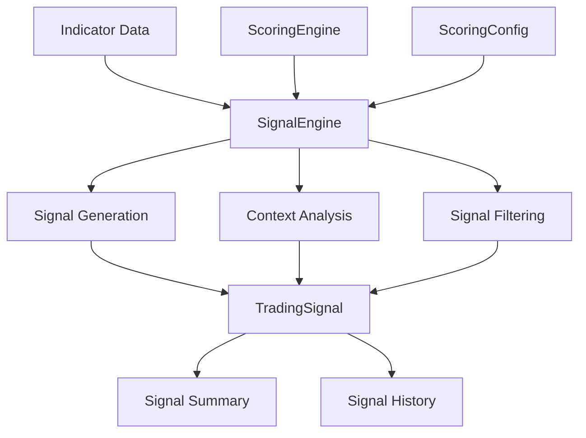

# Signal Engine Documentation

## Tổng quan

Signal Engine là mô-đun tạo và quản lý tín hiệu giao dịch dựa trên kết quả từ Indicator Engine và Scoring Engine. Engine này tập trung vào việc tạo tín hiệu có ngữ cảnh, lọc tín hiệu theo ngưỡng, và cung cấp thông tin chi tiết về từng tín hiệu.

## Kiến trúc



## Cấu trúc TradingSignal

```python
@dataclass
class TradingSignal:
    symbol: str
    timestamp: datetime
    action: SignalAction
    strength: SignalStrength
    score: float
    description: str
    triggered_rules: List[Dict[str, Any]]
    context: Dict[str, Any]
    indicators: Dict[str, Any]
    metadata: Dict[str, Any]
```

### Các trường dữ liệu

#### Thông tin cơ bản
- **symbol**: Mã cổ phiếu
- **timestamp**: Thời điểm tạo tín hiệu
- **action**: Hành động (MUA/BÁN/THEO DÕI)
- **strength**: Sức mạnh tín hiệu (WEAK/MEDIUM/STRONG/RẤT MẠNH)
- **score**: Điểm số tín hiệu
- **description**: Mô tả tín hiệu

#### Thông tin chi tiết
- **triggered_rules**: Danh sách quy tắc kích hoạt
- **context**: Ngữ cảnh thị trường
- **indicators**: Giá trị chỉ số tại thời điểm tín hiệu
- **metadata**: Thông tin bổ sung

## Tạo tín hiệu

### 1. Phương thức chính

```python
def generate_signals(self, df: pd.DataFrame, symbol: str, min_score_threshold: float = 10.0) -> List[TradingSignal]:
    """Generate trading signals for a symbol"""
    signals = []
    
    # Lọc các điểm dữ liệu có đủ chỉ số
    valid_indices = self._get_valid_indices(df)
    
    for index in valid_indices:
        # Tính điểm cho điểm dữ liệu này
        score, triggered_rules = self.scoring_engine.calculate_score(df, index)
        
        # Kiểm tra ngưỡng tối thiểu
        if abs(score) < min_score_threshold:
            continue
        
        # Tạo tín hiệu
        signal = self._create_signal(
            df=df,
            index=index,
            symbol=symbol,
            score=score,
            triggered_rules=triggered_rules
        )
        
        if signal:
            signals.append(signal)
    
    return signals
```

### 2. Tạo tín hiệu đơn lẻ

```python
def _create_signal(self, df: pd.DataFrame, index: int, symbol: str, score: float, triggered_rules: List[Dict]) -> Optional[TradingSignal]:
    """Create a single trading signal"""
    try:
        row = df.iloc[index]
        timestamp = df.index[index]
        
        # Xác định ngữ cảnh
        context = self._analyze_context(df, index)
        
        # Tạo tín hiệu từ điểm số
        action, strength, description = self.scoring_engine.generate_signal(score, context.get('trend', ''))
        
        # Lấy giá trị chỉ số
        indicators = self._extract_indicators(row)
        
        # Tạo metadata
        metadata = self._create_metadata(df, index, score)
        
        # Tạo tín hiệu
        signal = TradingSignal(
            symbol=symbol,
            timestamp=timestamp,
            action=action,
            strength=strength,
            score=score,
            description=description,
            triggered_rules=triggered_rules,
            context=context,
            indicators=indicators,
            metadata=metadata
        )
        
        return signal
        
    except Exception as e:
        logger.error(f"Error creating signal for {symbol} at index {index}: {e}")
        return None
```

## Phân tích ngữ cảnh

### 1. Xác định xu hướng

```python
def _analyze_context(self, df: pd.DataFrame, index: int) -> Dict[str, Any]:
    """Analyze market context for signal generation"""
    context = {}
    
    if index < 1:
        return context
    
    row = df.iloc[index]
    prev_row = df.iloc[index - 1]
    
    # Xu hướng dựa trên MA
    ma9 = row.get('MA9', 0)
    ma50 = row.get('MA50', 0)
    
    if ma9 > ma50:
        context['trend'] = 'uptrend'
    elif ma9 < ma50:
        context['trend'] = 'downtrend'
    else:
        context['trend'] = 'sideways'
    
    # Biến động dựa trên Bollinger Bands
    bb_width = row.get('BB_Width', 0)
    if bb_width > 0.2:
        context['volatility'] = 'high'
    elif bb_width < 0.1:
        context['volatility'] = 'low'
    else:
        context['volatility'] = 'medium'
    
    # Volume
    volume_spike = row.get('Volume_Spike', 1.0)
    if volume_spike > 2.0:
        context['volume'] = 'very_high'
    elif volume_spike > 1.5:
        context['volume'] = 'high'
    elif volume_spike < 0.5:
        context['volume'] = 'low'
    else:
        context['volume'] = 'normal'
    
    # RSI Zone
    rsi = row.get('RSI', 50)
    if rsi > 70:
        context['rsi_zone'] = 'overbought'
    elif rsi < 30:
        context['rsi_zone'] = 'oversold'
    else:
        context['rsi_zone'] = 'neutral'
    
    # Ichimoku
    close = row.get('Close', 0)
    senkou_a = row.get('Senkou_Span_A', 0)
    senkou_b = row.get('Senkou_Span_B', 0)
    
    if close > senkou_a and close > senkou_b:
        context['ichimoku'] = 'bullish'
    elif close < senkou_a and close < senkou_b:
        context['ichimoku'] = 'bearish'
    else:
        context['ichimoku'] = 'neutral'
    
    # Vị trí giá
    bb_upper = row.get('BB_Upper', 0)
    bb_lower = row.get('BB_Lower', 0)
    
    if close > bb_upper:
        context['price_position'] = 'above_bb_upper'
    elif close < bb_lower:
        context['price_position'] = 'below_bb_lower'
    else:
        context['price_position'] = 'within_bb'
    
    return context
```

### 2. Ngữ cảnh nâng cao

```python
def _analyze_advanced_context(self, df: pd.DataFrame, index: int) -> Dict[str, Any]:
    """Analyze advanced market context"""
    context = {}
    
    if index < 5:
        return context
    
    # Phân tích 5 kỳ gần nhất
    recent_data = df.iloc[max(0, index-5):index+1]
    
    # Xu hướng giá gần đây
    price_change = recent_data['Close'].pct_change().mean()
    if price_change > 0.02:
        context['recent_trend'] = 'strong_uptrend'
    elif price_change > 0.005:
        context['recent_trend'] = 'uptrend'
    elif price_change < -0.02:
        context['recent_trend'] = 'strong_downtrend'
    elif price_change < -0.005:
        context['recent_trend'] = 'downtrend'
    else:
        context['recent_trend'] = 'sideways'
    
    # Biến động gần đây
    volatility = recent_data['Close'].std()
    avg_volatility = df['Close'].rolling(20).std().mean()
    
    if volatility > avg_volatility * 1.5:
        context['recent_volatility'] = 'high'
    elif volatility < avg_volatility * 0.5:
        context['recent_volatility'] = 'low'
    else:
        context['recent_volatility'] = 'normal'
    
    # Volume pattern
    volume_trend = recent_data['Volume'].pct_change().mean()
    if volume_trend > 0.1:
        context['volume_trend'] = 'increasing'
    elif volume_trend < -0.1:
        context['volume_trend'] = 'decreasing'
    else:
        context['volume_trend'] = 'stable'
    
    return context
```

## Lọc tín hiệu

### 1. Lọc theo ngưỡng

```python
def filter_signals_by_threshold(self, signals: List[TradingSignal], min_score: float = 10.0) -> List[TradingSignal]:
    """Filter signals by minimum score threshold"""
    return [signal for signal in signals if abs(signal.score) >= min_score]
```

### 2. Lọc theo sức mạnh

```python
def filter_signals_by_strength(self, signals: List[TradingSignal], min_strength: SignalStrength = SignalStrength.MEDIUM) -> List[TradingSignal]:
    """Filter signals by minimum strength"""
    strength_order = {
        SignalStrength.WEAK: 1,
        SignalStrength.MEDIUM: 2,
        SignalStrength.STRONG: 3,
        SignalStrength.VERY_STRONG: 4
    }
    
    min_strength_value = strength_order[min_strength]
    
    return [
        signal for signal in signals 
        if strength_order[signal.strength] >= min_strength_value
    ]
```

### 3. Lọc theo ngữ cảnh

```python
def filter_signals_by_context(self, signals: List[TradingSignal], context_filters: Dict[str, Any]) -> List[TradingSignal]:
    """Filter signals by context criteria"""
    filtered_signals = []
    
    for signal in signals:
        match = True
        
        for key, value in context_filters.items():
            if key not in signal.context:
                match = False
                break
            
            if signal.context[key] != value:
                match = False
                break
        
        if match:
            filtered_signals.append(signal)
    
    return filtered_signals
```

### 4. Lọc trùng lặp

```python
def remove_duplicate_signals(self, signals: List[TradingSignal], time_window_hours: int = 24) -> List[TradingSignal]:
    """Remove duplicate signals within a time window"""
    if not signals:
        return []
    
    # Sắp xếp theo thời gian
    sorted_signals = sorted(signals, key=lambda x: x.timestamp)
    
    filtered_signals = []
    last_signal_time = None
    
    for signal in sorted_signals:
        if last_signal_time is None:
            filtered_signals.append(signal)
            last_signal_time = signal.timestamp
        else:
            time_diff = signal.timestamp - last_signal_time
            if time_diff.total_seconds() >= time_window_hours * 3600:
                filtered_signals.append(signal)
                last_signal_time = signal.timestamp
    
    return filtered_signals
```

## Trích xuất chỉ số

### 1. Chỉ số cơ bản

```python
def _extract_indicators(self, row: pd.Series) -> Dict[str, Any]:
    """Extract indicator values from a data row"""
    indicators = {}
    
    # Price data
    indicators['price'] = {
        'open': row.get('Open', 0),
        'high': row.get('High', 0),
        'low': row.get('Low', 0),
        'close': row.get('Close', 0),
        'volume': row.get('Volume', 0)
    }
    
    # Moving averages
    indicators['moving_averages'] = {
        'ma9': row.get('MA9', 0),
        'ma20': row.get('MA20', 0),
        'ma50': row.get('MA50', 0)
    }
    
    # Momentum
    indicators['momentum'] = {
        'rsi': row.get('RSI', 50),
        'macd': row.get('MACD', 0),
        'macd_signal': row.get('Signal_Line', 0),
        'macd_hist': row.get('MACD_Hist', 0)
    }
    
    # Volatility
    indicators['volatility'] = {
        'bb_upper': row.get('BB_Upper', 0),
        'bb_lower': row.get('BB_Lower', 0),
        'bb_width': row.get('BB_Width', 0)
    }
    
    # Volume
    indicators['volume'] = {
        'volume': row.get('Volume', 0),
        'volume_avg': row.get('Vol_Avg_20', 0),
        'volume_spike': row.get('Volume_Spike', 1.0),
        'obv': row.get('OBV', 0),
        'obv_ma20': row.get('OBV_MA20', 0)
    }
    
    # Ichimoku
    indicators['ichimoku'] = {
        'tenkan': row.get('Tenkan_sen', 0),
        'kijun': row.get('Kijun_sen', 0),
        'senkou_a': row.get('Senkou_Span_A', 0),
        'senkou_b': row.get('Senkou_Span_B', 0)
    }
    
    return indicators
```

### 2. Chỉ số nâng cao

```python
def _extract_advanced_indicators(self, df: pd.DataFrame, index: int) -> Dict[str, Any]:
    """Extract advanced indicator values"""
    indicators = {}
    
    if index < 1:
        return indicators
    
    row = df.iloc[index]
    prev_row = df.iloc[index - 1]
    
    # Price changes
    indicators['price_changes'] = {
        'daily_change': row.get('Close', 0) - prev_row.get('Close', 0),
        'daily_change_pct': (row.get('Close', 0) - prev_row.get('Close', 0)) / prev_row.get('Close', 1) * 100,
        'high_low_range': row.get('High', 0) - row.get('Low', 0),
        'close_position': (row.get('Close', 0) - row.get('Low', 0)) / (row.get('High', 0) - row.get('Low', 1))
    }
    
    # Moving average relationships
    ma9 = row.get('MA9', 0)
    ma20 = row.get('MA20', 0)
    ma50 = row.get('MA50', 0)
    
    indicators['ma_relationships'] = {
        'ma9_ma20_spread': ma9 - ma20,
        'ma9_ma50_spread': ma9 - ma50,
        'ma20_ma50_spread': ma20 - ma50,
        'price_ma9_spread': row.get('Close', 0) - ma9,
        'price_ma20_spread': row.get('Close', 0) - ma20,
        'price_ma50_spread': row.get('Close', 0) - ma50
    }
    
    # RSI momentum
    rsi = row.get('RSI', 50)
    prev_rsi = prev_row.get('RSI', 50)
    
    indicators['rsi_momentum'] = {
        'rsi_change': rsi - prev_rsi,
        'rsi_momentum': 'bullish' if rsi > prev_rsi else 'bearish',
        'rsi_zone': 'overbought' if rsi > 70 else 'oversold' if rsi < 30 else 'neutral'
    }
    
    return indicators
```

## Tạo metadata

### 1. Metadata cơ bản

```python
def _create_metadata(self, df: pd.DataFrame, index: int, score: float) -> Dict[str, Any]:
    """Create metadata for a signal"""
    metadata = {}
    
    # Thông tin cơ bản
    metadata['data_points'] = len(df)
    metadata['signal_index'] = index
    metadata['signal_date'] = df.index[index].date().isoformat()
    metadata['signal_time'] = df.index[index].isoformat()
    
    # Thông tin điểm số
    metadata['score'] = score
    metadata['score_abs'] = abs(score)
    metadata['score_category'] = self._categorize_score(score)
    
    # Thông tin dữ liệu
    metadata['data_start'] = df.index[0].isoformat()
    metadata['data_end'] = df.index[-1].isoformat()
    metadata['data_span_days'] = (df.index[-1] - df.index[0]).days
    
    # Thông tin hiệu suất
    metadata['calculation_time'] = datetime.now().isoformat()
    metadata['engine_version'] = '1.0.0'
    
    return metadata
```

### 2. Metadata nâng cao

```python
def _create_advanced_metadata(self, df: pd.DataFrame, index: int, score: float, triggered_rules: List[Dict]) -> Dict[str, Any]:
    """Create advanced metadata for a signal"""
    metadata = self._create_metadata(df, index, score)
    
    # Thông tin quy tắc
    metadata['rules'] = {
        'total_rules': len(triggered_rules),
        'positive_rules': len([r for r in triggered_rules if r.get('score', 0) > 0]),
        'negative_rules': len([r for r in triggered_rules if r.get('score', 0) < 0]),
        'rule_names': [r.get('name', '') for r in triggered_rules],
        'rule_scores': [r.get('score', 0) for r in triggered_rules]
    }
    
    # Thống kê dữ liệu
    if index >= 20:
        recent_data = df.iloc[max(0, index-20):index+1]
        metadata['recent_stats'] = {
            'avg_volume': recent_data['Volume'].mean(),
            'avg_volatility': recent_data['Close'].std(),
            'price_range': recent_data['Close'].max() - recent_data['Close'].min(),
            'volume_trend': recent_data['Volume'].pct_change().mean()
        }
    
    # Thông tin xu hướng
    if index >= 5:
        trend_data = df.iloc[max(0, index-5):index+1]
        metadata['trend_info'] = {
            'trend_direction': 'up' if trend_data['Close'].iloc[-1] > trend_data['Close'].iloc[0] else 'down',
            'trend_strength': abs(trend_data['Close'].pct_change().sum()),
            'trend_consistency': len([x for x in trend_data['Close'].diff() if x > 0]) / len(trend_data)
        }
    
    return metadata
```

## Tóm tắt tín hiệu

### 1. Tóm tắt cơ bản

```python
def get_signal_summary(self, signals: List[TradingSignal]) -> Dict[str, Any]:
    """Get summary of generated signals"""
    if not signals:
        return {
            'total_signals': 0,
            'buy_signals': 0,
            'sell_signals': 0,
            'hold_signals': 0,
            'strong_signals': 0,
            'medium_signals': 0,
            'weak_signals': 0,
            'avg_score': 0.0,
            'max_score': 0.0,
            'min_score': 0.0
        }
    
    # Đếm theo hành động
    buy_signals = [s for s in signals if s.action == SignalAction.BUY]
    sell_signals = [s for s in signals if s.action == SignalAction.SELL]
    hold_signals = [s for s in signals if s.action == SignalAction.HOLD]
    
    # Đếm theo sức mạnh
    strong_signals = [s for s in signals if s.strength in [SignalStrength.STRONG, SignalStrength.VERY_STRONG]]
    medium_signals = [s for s in signals if s.strength == SignalStrength.MEDIUM]
    weak_signals = [s for s in signals if s.strength == SignalStrength.WEAK]
    
    # Thống kê điểm số
    scores = [s.score for s in signals]
    
    return {
        'total_signals': len(signals),
        'buy_signals': len(buy_signals),
        'sell_signals': len(sell_signals),
        'hold_signals': len(hold_signals),
        'strong_signals': len(strong_signals),
        'medium_signals': len(medium_signals),
        'weak_signals': len(weak_signals),
        'avg_score': sum(scores) / len(scores) if scores else 0.0,
        'max_score': max(scores) if scores else 0.0,
        'min_score': min(scores) if scores else 0.0,
        'score_std': np.std(scores) if scores else 0.0
    }
```

### 2. Tóm tắt nâng cao

```python
def get_advanced_signal_summary(self, signals: List[TradingSignal]) -> Dict[str, Any]:
    """Get advanced summary of generated signals"""
    basic_summary = self.get_signal_summary(signals)
    
    if not signals:
        return basic_summary
    
    # Phân tích theo ngữ cảnh
    context_analysis = {}
    for signal in signals:
        for key, value in signal.context.items():
            if key not in context_analysis:
                context_analysis[key] = {}
            if value not in context_analysis[key]:
                context_analysis[key][value] = 0
            context_analysis[key][value] += 1
    
    # Phân tích theo quy tắc
    rule_analysis = {}
    for signal in signals:
        for rule in signal.triggered_rules:
            rule_name = rule.get('name', 'unknown')
            if rule_name not in rule_analysis:
                rule_analysis[rule_name] = {
                    'count': 0,
                    'total_score': 0.0,
                    'avg_score': 0.0
                }
            rule_analysis[rule_name]['count'] += 1
            rule_analysis[rule_name]['total_score'] += rule.get('score', 0)
    
    # Tính điểm trung bình cho mỗi quy tắc
    for rule_name, data in rule_analysis.items():
        if data['count'] > 0:
            data['avg_score'] = data['total_score'] / data['count']
    
    # Phân tích theo thời gian
    time_analysis = {}
    for signal in signals:
        hour = signal.timestamp.hour
        if hour not in time_analysis:
            time_analysis[hour] = 0
        time_analysis[hour] += 1
    
    return {
        **basic_summary,
        'context_analysis': context_analysis,
        'rule_analysis': rule_analysis,
        'time_analysis': time_analysis,
        'signal_frequency': len(signals) / ((signals[-1].timestamp - signals[0].timestamp).days + 1) if len(signals) > 1 else 0
    }
```

## Sử dụng

### 1. Khởi tạo Engine

```python
from analytis.engines.signal_engine import SignalEngine
from analytis.engines.indicator_engine import IndicatorEngine
from analytis.engines.scoring_engine import ScoringEngine

# Khởi tạo các engine phụ thuộc
indicator_engine = IndicatorEngine()
scoring_engine = ScoringEngine()

# Khởi tạo signal engine
signal_engine = SignalEngine(indicator_engine, scoring_engine)
```

### 2. Tạo tín hiệu

```python
# Tạo tín hiệu cho một mã cổ phiếu
signals = signal_engine.generate_signals(
    df=df_with_indicators,
    symbol="PDR",
    min_score_threshold=15.0
)

print(f"Tạo được {len(signals)} tín hiệu")

# Xem tín hiệu gần nhất
if signals:
    latest_signal = signals[-1]
    print(f"Tín hiệu gần nhất: {latest_signal.action.value} {latest_signal.strength.value}")
    print(f"Điểm số: {latest_signal.score}")
    print(f"Mô tả: {latest_signal.description}")
```

### 3. Lọc tín hiệu

```python
# Lọc tín hiệu mua mạnh
buy_signals = [s for s in signals if s.action == SignalAction.BUY and s.strength == SignalStrength.VERY_STRONG]

# Lọc tín hiệu theo ngữ cảnh
uptrend_signals = signal_engine.filter_signals_by_context(
    signals, 
    {'trend': 'uptrend', 'volatility': 'medium'}
)

# Lọc tín hiệu theo sức mạnh
strong_signals = signal_engine.filter_signals_by_strength(
    signals, 
    SignalStrength.STRONG
)
```

### 4. Tóm tắt tín hiệu

```python
# Tóm tắt cơ bản
summary = signal_engine.get_signal_summary(signals)
print(f"Tổng tín hiệu: {summary['total_signals']}")
print(f"Tín hiệu mua: {summary['buy_signals']}")
print(f"Tín hiệu bán: {summary['sell_signals']}")
print(f"Điểm trung bình: {summary['avg_score']:.2f}")

# Tóm tắt nâng cao
advanced_summary = signal_engine.get_advanced_signal_summary(signals)
print(f"Phân tích ngữ cảnh: {advanced_summary['context_analysis']}")
print(f"Phân tích quy tắc: {advanced_summary['rule_analysis']}")
```

## Tùy chỉnh

### 1. Thêm ngữ cảnh mới

```python
class CustomSignalEngine(SignalEngine):
    def _analyze_context(self, df: pd.DataFrame, index: int) -> Dict[str, Any]:
        # Gọi phương thức gốc
        context = super()._analyze_context(df, index)
        
        # Thêm ngữ cảnh tùy chỉnh
        if index >= 10:
            recent_data = df.iloc[max(0, index-10):index+1]
            
            # Phân tích momentum
            momentum = recent_data['Close'].pct_change().mean()
            if momentum > 0.01:
                context['momentum'] = 'strong_bullish'
            elif momentum > 0.005:
                context['momentum'] = 'bullish'
            elif momentum < -0.01:
                context['momentum'] = 'strong_bearish'
            elif momentum < -0.005:
                context['momentum'] = 'bearish'
            else:
                context['momentum'] = 'neutral'
            
            # Phân tích support/resistance
            recent_high = recent_data['High'].max()
            recent_low = recent_data['Low'].min()
            current_price = df.iloc[index]['Close']
            
            if current_price > recent_high * 0.98:
                context['price_level'] = 'near_resistance'
            elif current_price < recent_low * 1.02:
                context['price_level'] = 'near_support'
            else:
                context['price_level'] = 'middle_range'
        
        return context
```

### 2. Thêm bộ lọc tùy chỉnh

```python
class CustomSignalEngine(SignalEngine):
    def filter_signals_by_momentum(self, signals: List[TradingSignal]) -> List[TradingSignal]:
        """Filter signals by momentum context"""
        return [
            signal for signal in signals 
            if signal.context.get('momentum') in ['strong_bullish', 'strong_bearish']
        ]
    
    def filter_signals_by_price_level(self, signals: List[TradingSignal]) -> List[TradingSignal]:
        """Filter signals by price level context"""
        return [
            signal for signal in signals 
            if signal.context.get('price_level') in ['near_support', 'near_resistance']
        ]
    
    def filter_signals_by_volume(self, signals: List[TradingSignal]) -> List[TradingSignal]:
        """Filter signals by volume context"""
        return [
            signal for signal in signals 
            if signal.context.get('volume') in ['high', 'very_high']
        ]
```

### 3. Tùy chỉnh metadata

```python
class CustomSignalEngine(SignalEngine):
    def _create_metadata(self, df: pd.DataFrame, index: int, score: float) -> Dict[str, Any]:
        # Gọi phương thức gốc
        metadata = super()._create_metadata(df, index, score)
        
        # Thêm metadata tùy chỉnh
        if index >= 5:
            recent_data = df.iloc[max(0, index-5):index+1]
            
            # Thông tin biến động
            metadata['volatility_info'] = {
                'recent_volatility': recent_data['Close'].std(),
                'volatility_trend': recent_data['Close'].std() - df.iloc[max(0, index-10):index-5]['Close'].std(),
                'volatility_percentile': self._calculate_volatility_percentile(df, index)
            }
            
            # Thông tin volume
            metadata['volume_info'] = {
                'recent_volume_avg': recent_data['Volume'].mean(),
                'volume_trend': recent_data['Volume'].pct_change().mean(),
                'volume_percentile': self._calculate_volume_percentile(df, index)
            }
        
        return metadata
    
    def _calculate_volatility_percentile(self, df: pd.DataFrame, index: int) -> float:
        """Calculate volatility percentile"""
        if index < 20:
            return 50.0
        
        current_volatility = df.iloc[index]['Close']
        historical_volatility = df.iloc[max(0, index-20):index]['Close'].std()
        
        # Tính percentile (simplified)
        return min(100.0, max(0.0, (current_volatility / historical_volatility) * 50))
    
    def _calculate_volume_percentile(self, df: pd.DataFrame, index: int) -> float:
        """Calculate volume percentile"""
        if index < 20:
            return 50.0
        
        current_volume = df.iloc[index]['Volume']
        historical_volumes = df.iloc[max(0, index-20):index]['Volume']
        
        # Tính percentile
        percentile = (historical_volumes < current_volume).sum() / len(historical_volumes) * 100
        return percentile
```

## Best Practices

### 1. Xử lý lỗi

```python
def generate_signals_safely(self, df: pd.DataFrame, symbol: str, min_score_threshold: float = 10.0) -> List[TradingSignal]:
    """Generate signals with error handling"""
    try:
        # Kiểm tra dữ liệu đầu vào
        if df.empty:
            logger.warning(f"Empty dataframe for {symbol}")
            return []
        
        if len(df) < 50:
            logger.warning(f"Insufficient data for {symbol}: {len(df)} points")
            return []
        
        # Tạo tín hiệu
        signals = self.generate_signals(df, symbol, min_score_threshold)
        
        # Kiểm tra kết quả
        if not signals:
            logger.info(f"No signals generated for {symbol}")
            return []
        
        logger.info(f"Generated {len(signals)} signals for {symbol}")
        return signals
        
    except Exception as e:
        logger.error(f"Error generating signals for {symbol}: {e}")
        return []
```

### 2. Tối ưu hiệu suất

```python
def generate_signals_optimized(self, df: pd.DataFrame, symbol: str, min_score_threshold: float = 10.0) -> List[TradingSignal]:
    """Generate signals with performance optimization"""
    # Pre-calculate valid indices
    valid_indices = self._get_valid_indices(df)
    
    if not valid_indices:
        return []
    
    # Batch process signals
    signals = []
    batch_size = 100
    
    for i in range(0, len(valid_indices), batch_size):
        batch_indices = valid_indices[i:i+batch_size]
        batch_signals = self._process_batch(df, symbol, batch_indices, min_score_threshold)
        signals.extend(batch_signals)
    
    return signals

def _process_batch(self, df: pd.DataFrame, symbol: str, indices: List[int], min_score_threshold: float) -> List[TradingSignal]:
    """Process a batch of indices"""
    signals = []
    
    for index in indices:
        try:
            score, triggered_rules = self.scoring_engine.calculate_score(df, index)
            
            if abs(score) >= min_score_threshold:
                signal = self._create_signal(df, index, symbol, score, triggered_rules)
                if signal:
                    signals.append(signal)
        except Exception as e:
            logger.warning(f"Error processing index {index} for {symbol}: {e}")
            continue
    
    return signals
```

### 3. Logging và monitoring

```python
import time
import logging

logger = logging.getLogger(__name__)

def generate_signals_with_monitoring(self, df: pd.DataFrame, symbol: str, min_score_threshold: float = 10.0) -> List[TradingSignal]:
    """Generate signals with monitoring"""
    start_time = time.time()
    
    try:
        # Tạo tín hiệu
        signals = self.generate_signals(df, symbol, min_score_threshold)
        
        # Tính thời gian xử lý
        processing_time = time.time() - start_time
        
        # Log thông tin
        logger.info(f"Signal generation completed for {symbol}")
        logger.info(f"Processing time: {processing_time:.2f}s")
        logger.info(f"Data points: {len(df)}")
        logger.info(f"Signals generated: {len(signals)}")
        logger.info(f"Signals per second: {len(signals) / processing_time:.2f}")
        
        # Log chi tiết tín hiệu
        if signals:
            summary = self.get_signal_summary(signals)
            logger.info(f"Signal summary: {summary}")
        
        return signals
        
    except Exception as e:
        processing_time = time.time() - start_time
        logger.error(f"Signal generation failed for {symbol} after {processing_time:.2f}s: {e}")
        raise
```

## Troubleshooting

### 1. Lỗi "Index out of range"

**Nguyên nhân**: Truy cập index không hợp lệ

**Giải pháp**:
```python
def _get_valid_indices(self, df: pd.DataFrame) -> List[int]:
    """Get valid indices for signal generation"""
    # Đảm bảo có đủ dữ liệu
    min_required = 50  # Ít nhất 50 điểm dữ liệu
    if len(df) < min_required:
        return []
    
    # Chỉ xử lý từ index 50 trở đi
    return list(range(min_required, len(df)))
```

### 2. Lỗi "KeyError: 'Close'"

**Nguyên nhân**: Thiếu cột dữ liệu

**Giải pháp**:
```python
def _validate_dataframe(self, df: pd.DataFrame) -> bool:
    """Validate dataframe structure"""
    required_columns = ['Open', 'High', 'Low', 'Close', 'Volume']
    return all(col in df.columns for col in required_columns)

def generate_signals(self, df: pd.DataFrame, symbol: str, min_score_threshold: float = 10.0) -> List[TradingSignal]:
    """Generate signals with validation"""
    if not self._validate_dataframe(df):
        logger.error(f"Invalid dataframe structure for {symbol}")
        return []
    
    # Tiếp tục xử lý...
```

### 3. Lỗi "Empty signals list"

**Nguyên nhân**: Không có tín hiệu nào đạt ngưỡng

**Giải pháp**:
```python
def generate_signals_with_fallback(self, df: pd.DataFrame, symbol: str, min_score_threshold: float = 10.0) -> List[TradingSignal]:
    """Generate signals with fallback threshold"""
    # Thử với ngưỡng ban đầu
    signals = self.generate_signals(df, symbol, min_score_threshold)
    
    # Nếu không có tín hiệu, giảm ngưỡng
    if not signals and min_score_threshold > 5.0:
        logger.info(f"No signals with threshold {min_score_threshold}, trying lower threshold")
        signals = self.generate_signals(df, symbol, min_score_threshold * 0.5)
    
    return signals
```
